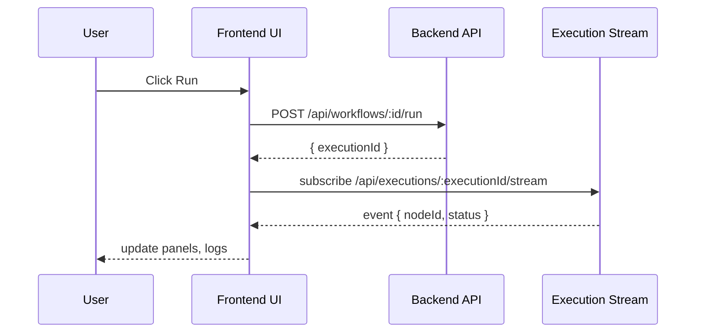

## OPR Frontend — Architecture Reference

This document is the single-source architecture reference for the `opr-frontend` application. It is written for engineering contributors who need to understand:

- How components are organized and where to add new UI or pages.
- How data flows through the app and which contexts/hooks manage it.
- Where and how the frontend integrates with backend services.
- Authentication strategies used and recommended security practices.
- The complete workflow execution lifecycle from compose → run → observe.

Files referenced are relative to `opr-frontend/src` unless noted otherwise. If you are onboarding, start with `src/app/layout.tsx` and `src/provider/userprovider.tsx` to see providers wired into the app.

---

### Goals of this document

1. Make it fast for a new engineer to locate the right file to change.
2. Reduce accidental breakage by clarifying contracts (payloads, events).
3. Provide operational guidance (observability, retries, auth refresh).
4. Offer a contributor checklist for modifying the workflow model or execution flow.

---

## Quick map (where to look)

- App shell & routing: `src/app/layout.tsx`, `src/app/page.tsx`
- Landing and marketing pages: `src/app/_landingPage/*`
- Top-level pages: `src/app/*` (each page folder contains `page.tsx` and local components)
- Reusable UI primitives: `src/components/ui/*`
- Domain components & panels: `src/components/*` (examples: `BTreeExplorerPanel.tsx`, `PerformancePanel.tsx`, `SagaTransactionMonitor.tsx`)
- Hooks (behavior & effects): `src/hooks/*` (notable: `useGoogleAuth.ts`, `useLoadWorkflow.ts`, `useRunWorkflow.ts`, `useSaveWorkflow.ts`)
- Client libraries & serializers: `src/lib/*` (notable: `api.ts`, `auth.ts`, `serializeWorkflowData.ts`, `nodeInputRegistry.ts`, `nodeOutputRegistry.ts`)
- Context & providers (global state): `src/provider/*` (notable: `statecontext.tsx`, `userprovider.tsx`, `themeprovider.tsx`, `dragprovider.tsx`, `sidebarContext.tsx`)

Tip: Grep for `serializeWorkflowData` or `useRunWorkflow` to find the canonical run/save flow.

---

## Glossary

- Workflow: a user-created graph of nodes and edges representing a process.
- Node: a single functional block in a workflow (e.g., LLM call, data transform).
- Execution: a single run/instance of a workflow.
- Provider / Context: React components that expose global/shared state via React Context.
- Hook: a custom React hook encapsulating logic and side effects.

---

## Component hierarchy and organization (detailed)

This section expands the earlier high-level view into actionable locations and responsibilities.

1) App Shell & Providers
  - `src/app/layout.tsx` — root app component. Responsibilities:
    - Mounts global CSS and layout structure.
    - Wraps pages with global providers (`userprovider`, `statecontext`, `themeprovider`, etc.).
  - `src/app/page.tsx` — default landing page for the root route.

2) Pages (feature composition)
  - Each folder under `src/app` corresponds to a route and contains a `page.tsx` that composes domain UI.
  - Examples:
    - `src/app/flow/page.tsx` — main workflow editor screen. Composes: sidebar, canvas, run controls, inspector.
    - `src/app/auth/page.tsx` — auth-related UI.

3) Components
  - `src/components/ui/*` — atomic UI primitives (Buttons, Inputs, Avatar, Icon, Modal). Keep these purely presentational with minimal props.
  - `src/components/*` — higher-level, domain-specific components and panels. Examples:
    - `BTreeExplorerPanel.tsx` — tree explorer UI for debugging.
    - `PerformancePanel.tsx` — runtime metrics and performance graphs.
    - `SagaTransactionMonitor.tsx` — monitor for long-running saga-style runs.

4) Hooks & Behaviour
  - `src/hooks/*` contains hooks that perform network calls, side-effects, and complex logic. Keep hooks testable and side-effect isolated.
  - Notable hooks:
    - `useLoadWorkflow.ts` — fetches workflow JSON and hydrates the editor context.
    - `useSaveWorkflow.ts` — serializes editor state and persists it.
    - `useRunWorkflow.ts` — orchestrates run request and subscribes to progress updates.
    - `useGoogleAuth.ts` — Google-specific OAuth flow helper.

5) Libraries & Registries
  - `src/lib/api.ts` — central HTTP client wrapper.
  - `src/lib/auth.ts` — token storage and refresh helpers (thin client-side logic only).
  - `src/lib/serializeWorkflowData.ts` — converts editor model to backend payload.
  - `src/lib/nodeInputRegistry.ts` and `nodeOutputRegistry.ts` — canonical definitions for node input/output types used for client-side validation and forms.

6) Providers & Contexts
  - `src/provider/statecontext.tsx` — holds the primary editor model (nodes, edges, selection, canvas transform).
  - `src/provider/userprovider.tsx` — holds authentication/user profile state.
  - `src/provider/sidebarContext.tsx` — sidebar state and selection.
  - `src/provider/dragprovider.tsx` — drag/drop behavior for the canvas.

Best practice: when adding behavior that multiple components need, prefer adding it to an existing provider rather than propagating props deeply.

---

## Data flow and state management (patterns & rules)

This app intentionally favors small, well-scoped contexts and hooks to keep components lean and to enable unit testing.

Data ownership rules:
1. The editor model (nodes, edges, viewport) is owned by `statecontext`.
2. Auth state is owned by `userprovider` and accessed by `lib/api.ts` when making requests.
3. Runtime execution state (current runs, logs, node outputs) can be held in a separate execution context or attached to `statecontext` depending on the feature scope.

Typical data pathways:
- User edits canvas -> local component state updates -> dispatch to `statecontext` reducers -> context updates cause subscribers (palette, inspector, runtime panels) to rerender.
- User clicks "Save" -> `useSaveWorkflow` reads `statecontext`, calls `serializeWorkflowData`, then `lib/api.ts` to POST. On response, hook writes server id/metadata back to `statecontext`.
- User clicks "Run" -> `useRunWorkflow` posts run request and subscribes to progress updates (websocket/polling). Execution events update execution context/state and runtime panels consume it.

Example sequence (high level):

1. User edits node properties in Inspector -> Inspector calls context action updateNodeConfig(nodeId, config)
2. `statecontext` reducer applies change -> updates state and persists local autosave draft
3. User hits Run -> `useRunWorkflow` serializes state and calls POST /workflows/:id/run
4. Server returns executionId -> `useRunWorkflow` opens websocket or starts polling for execution updates
5. Execution events update execution context -> UI displays progress and per-node outputs

State shape recommendations (schema sketch):

statecontext (partial):

- nodes: { [nodeId]: { id, type, config, inputs, outputs, meta } }
- edges: [{ id, from, to, meta }]
- selection: { nodeId | null }
- viewport: { x, y, zoom }
- lastSavedAt: timestamp
- runSessions: { [executionId]: { status, events[], startedAt, finishedAt } }

---

## Integration points with backend (detailed)

Central client: `src/lib/api.ts`

Responsibilities of `api.ts`:
- Provide a single exported client object or functions that components/hooks use for all HTTP operations.
- Attach authentication and correlation headers automatically.
- Normalize error shape and throw meaningful exceptions for callers to handle.
- Optionally implement retry/backoff for idempotent operations.

Conceptual API surface (adjust to actual backend routes):

- POST /api/workflows
  - Purpose: create or update a workflow
  - Payload: serialized workflow

- GET /api/workflows/:id
  - Purpose: load a workflow by id

- POST /api/workflows/:id/run
  - Purpose: start workflow execution
  - Payload: { runParameters?: {}, overrideInputs?: {} }

- GET /api/executions/:executionId
  - Purpose: fetch execution status & data

- Websocket/SSE: /api/executions/:executionId/stream
  - Purpose: push execution events in real time

- Auth endpoints (server-defined): /api/auth/login, /api/auth/refresh, /api/auth/me

Sample client usage (pseudocode):

```ts
// src/hooks/useSaveWorkflow.ts (pseudo)
const save = async (workflow) => {
  const body = serializeWorkflowData(workflow);
  const res = await api.post('/api/workflows', body);
  return res.data; // { id, updatedAt }
}
```

Error handling rules:

- API should always return consistent error objects: { code, message, details? }
- UI should present friendly messages for common errors (network failure, validation errors, permission denied).
- For transient server errors (5xx), use exponential backoff and surface a retry button.

Observability:

- Attach correlation IDs to requests (X-Request-Id) to make tracing easier.
- Send client-side logs or error breadcrumbs to a monitoring backend when a run fails.

---

## Authentication flow (detailed)

Files to inspect:
- `src/hooks/useGoogleAuth.ts`
- `src/lib/auth.ts`
- `src/lib/api.ts`
- `src/provider/userprovider.tsx`

Typical flow (client-forwarded / oauth assisted via backend):

1. Unauthenticated user attempts an action that requires auth -> UI triggers `login()` from `userprovider`.
2. `useGoogleAuth` initiates OAuth handshake. The app should prefer a server-assisted flow where the backend performs token exchanges and issues an httpOnly cookie.
3. On successful sign-in, the backend sets a secure, httpOnly session cookie and returns a minimal profile object to the client.
4. `userprovider` stores the profile in memory and marks the user as authenticated.
5. `lib/api.ts` includes credentials (Fetch: credentials: 'include' or Authorization header) depending on server sessions or bearer tokens.
6. On 401 responses, `lib/api.ts` triggers a refresh flow (or redirects to login) and retries the original request when appropriate.

Storage & security guidance:

- Prefer server-set httpOnly cookies for refresh tokens; this reduces XSS risk.
- Access tokens should be short-lived and refreshed server-side. If storing tokens client-side, use in-memory only and rehydrate from server on page load.
- Avoid storing tokens in localStorage.

Token refresh strategy (recommended):

- Use a silent refresh endpoint on the server that reissues an httpOnly cookie when the user's session is still valid.
- Centralize refresh logic in `lib/api.ts` so all callers benefit from automatic transparent refresh.

Example flow for attaching auth (pseudocode):

```ts
// lib/api.ts pseudocode
async function request(path, opts = {}) {
  try {
    const res = await fetch(baseUrl + path, { ...opts, credentials: 'include' });
    if (res.status === 401) {
      await refreshSession();
      return fetch(baseUrl + path, { ...opts, credentials: 'include' });
    }
    return res.json();
  } catch (err) {
    // normalize and rethrow
  }
}
```

---

## Workflow execution lifecycle (expanded)

This section provides a run-book style breakdown of all stages and UI touchpoints.

Stages:

1) Compose / Design
  - User uses palette to place nodes on canvas and configures nodes via the inspector.
  - Local validation runs as user types (required fields, basic type checks using `nodeInputRegistry`).

2) Draft / Autosave
  - Editor triggers autosave on significant changes (debounced). Autosave writes a draft via `useSaveWorkflow` to `POST /api/workflows` with `draft=true`.
  - Autosave must be idempotent — include a client-only draftId or fingerprint to avoid duplicate drafts.

3) Validate (pre-run)
  - Before run, `serializeWorkflowData` enforces strict validation:
    - Nodes have required configs
    - Required inputs are connected or provided as runParameters
    - No cycles in graphs that the executor cannot handle

4) Start run
  - `useRunWorkflow` calls POST /api/workflows/:id/run
  - Backend returns `{ executionId, startedAt }`

5) Execution monitoring
  - The frontend subscribes to runtime events. Patterns:
    - Preferred: Websocket or SSE `/api/executions/:id/stream` (low latency)
    - Fallback: Poll `/api/executions/:id` at an adaptive interval
  - Events include per-node status, logs, errors, and aggregated metrics.

6) Results & post-run
  - When run finishes, UI surfaces success/failure and provides per-node output inspection, raw logs, and suggested remediation steps.

Run shape (example payloads)

Workflow save payload (example):

```json
{
  "id": "optional-uuid-if-existing",
  "name": "My workflow",
  "description": "...",
  "metadata": { "owner": "user@example.com", "tags": ["extract"] },
  "nodes": [
    { "id": "n1", "type": "llm", "config": { "model": "gpt-4" }, "inputs": {}, "outputs": {} }
  ],
  "edges": [
    { "fromNode": "n1", "fromPort": "out", "toNode": "n2", "toPort": "in" }
  ]
}
```

Run request (example):

```json
{
  "workflowId": "uuid-123",
  "runParameters": { "input": "Hello" },
  "overrides": { "n1": { "config": { "model": "gpt-4-mini" } } }
}
```

Execution event shape (example):

```json
{
  "executionId": "exec-123",
  "nodeId": "n1",
  "status": "success",
  "timestamp": "2026-04-23T10:00:00.000Z",
  "logs": ["started", "finished"],
  "output": { "text": "..." }
}
```

---

## Contracts and data shapes (complete checklist)

When changing a node's inputs/outputs or the global workflow shape, follow this checklist:

1. Update `nodeInputRegistry.ts` and `nodeOutputRegistry.ts` with canonical shapes.
2. Update `serializeWorkflowData.ts` to correctly serialize the new shapes.
3. Update unit tests in `src/hooks/__tests__` and `src/lib/__tests__` to cover serialization and validation.
4. Update backend API contract documentation and coordinate with backend team for migration.
5. Consider versioning workflows (add `version` field) and a migration path for stored workflows.

Versioning suggestion:

- Add `schemaVersion` to saved workflows. When deserializing, run migrations if a saved workflow's `schemaVersion` is older than current.

---

## Error handling, retries, and backoff

API client responsibilities (`lib/api.ts`):

- Normalize errors into { code, message, retryable }.
- Implement an exponential backoff strategy for retryable error codes (e.g., network failures, 429, 503) with jitter.
- For non-idempotent operations (e.g., run), avoid automatic retries unless the backend supports idempotency tokens.

Suggested retry logic (policy):

- Idempotent endpoints (GET, PUT with idempotency token): up to 3 retries with exponential backoff starting at 500ms.
- Non-idempotent endpoints (POST run): no auto-retry — surface a retry button to the user which will reattempt with clear UX.

User-facing error UX:

- Display actionable messages with a short explanation and a recommended next step.
- For validation errors, highlight offending nodes and show error messages in the inspector.

---

## Observability & Logging

Client-side telemetry:

- Capture important client-side events: workflow saved, run started, run failed, auth failure.
- Attach `X-Request-Id` to outgoing requests; surface this id in UI when displaying backend errors so support can correlate logs.
- When a run fails, log a compact event with { executionId, workflowId, userId, errorCode } to the telemetry backend.

Log verbosity:

- Keep console.debug for development only and gated behind an environment flag.
- Use structured JSON logs for crash reports to make parsing easier.

---

## Testing strategy

Unit tests
- Test `serializeWorkflowData.ts` with a variety of node shapes, including edge cases: missing required inputs, cycles, large graphs.
- Test hooks (`useSaveWorkflow`, `useRunWorkflow`) by mocking `lib/api.ts` responses and asserting behavior changes in contexts.

Integration tests
- Use `msw` (Mock Service Worker) to mock backend APIs and run integration tests that verify end-to-end flow for save/run/monitor.

E2E tests
- Use Playwright or Cypress to verify critical flows:
  - Sign in flow
  - Create simple workflow -> Save -> Run -> Observe results
  - Permission-denied case

Performance testing
- Simulate large workflows (100+ nodes) to ensure rendering and serialization remain performant.

CI recommendations
- Run unit tests and lint on every PR.
- Run a small set of Playwright smoke tests on the main branch after merge.

---

## Developer onboarding checklist

When you join the repo and want to change the workflow runtime or UI, follow these steps:

1. Run the frontend locally: follow `opr-frontend/README.md` (if missing, add run instructions).
2. Run unit tests: `pnpm test` or `npm run test` depending on project configuration.
3. Identify files to change (use the Quick map in this doc).
4. Update `nodeInputRegistry` and `nodeOutputRegistry` when adding/changing node I/O.
5. Update `serializeWorkflowData` and corresponding tests.
6. Coordinate with backend for API contract changes.

---

## Security considerations

1. XSS: do not store tokens in localStorage. Prefer server-set httpOnly cookies and short-lived access tokens.
2. CSRF: if using cookies, ensure backend sets and validates CSRF tokens on state-changing requests.
3. Principle of least privilege: users should only see workflows they are authorized to access. UI must respect permission errors returned by API.

---

## Performance and scaling tips

- Avoid rerender storms: memoize pure components and use context slices to prevent updates from touching unrelated subscribers.
- Virtualize large lists (node palettes, logs) to reduce DOM pressure.
- Debounce expensive operations (autosave, preview generation).

---

## Debugging tips & common pitfalls

- If nodes appear with missing inputs after load, check `serializeWorkflowData` and `node registries` for mismatched keys.
- If run status never updates, verify websocket/SSE endpoints and CORS settings on the backend.
- For 401 loops, inspect cookie attributes (Secure, SameSite) and whether `fetch` is sending credentials.

---

## Contributor guidelines (small additions that help maintainers)

1. When changing frontend contracts, add an entry in `docs/api-contracts.md` with sample request/response shapes.
2. Add or update unit tests that cover serialization and deserialization.
3. If adding long-running features (e.g., async jobs), add a monitoring panel with clear UX for cancelling and retrying.

---

## Appendix: diagrams and sequences

Sequence diagram (Mermaid) — run flow



Component interaction map (textual)

- `Inspector` updates node config -> `statecontext` reducer -> `statecontext` persists draft -> `useSaveWorkflow` triggered by user action
- `RunButton` calls `useRunWorkflow` -> `api` returns executionId -> `ExecutionProvider` subscribes to stream -> panels update

---

## Example change walk-through (add a new node type)

1. Add new node in frontend: `src/lib/nodeDefinitions/new-node.ts` and register it in `nodeInputRegistry` and `nodeOutputRegistry`.
2. Implement UI inspector fields under `src/components/inspector/NewNodeInspector.tsx`.
3. Add serializer hooks if the node requires special handling in `serializeWorkflowData.ts`.
4. Add unit tests for registry and serializer.
5. Coordinate with backend: provide API contract for node type and add backward compatible handling.

---

## File index (useful starting points)

- `src/app/layout.tsx` — app shell & provider wiring
- `src/app/flow/page.tsx` — main editor composition
- `src/components/ui/*` — UI primitives
- `src/components/*Panel.tsx` — runtime and debug panels
- `src/hooks/useRunWorkflow.ts` — run orchestration
- `src/hooks/useSaveWorkflow.ts` — save flow
- `src/lib/serializeWorkflowData.ts` — serializer
- `src/lib/api.ts` — HTTP client
- `src/lib/auth.ts` — auth helpers
- `src/provider/*.tsx` — contexts and global state

---

## Frequently asked questions

Q: Where should I put state for a small feature used across 2 components?
A: If it's UI-only and short-lived, keep it in a local parent component. If multiple non-related components need it, add a small context under `src/provider/` scoped to that domain.

Q: How do we handle breaking changes to workflow schema?
A: Add `schemaVersion`, add migration helpers on backend and frontend, and provide a compatibility shim that warns users when automatic migration is not possible.

Q: Should I use localStorage for user preferences?
A: Non-sensitive preferences (UI theme, panel layout) may be stored in localStorage. Never store tokens there.


